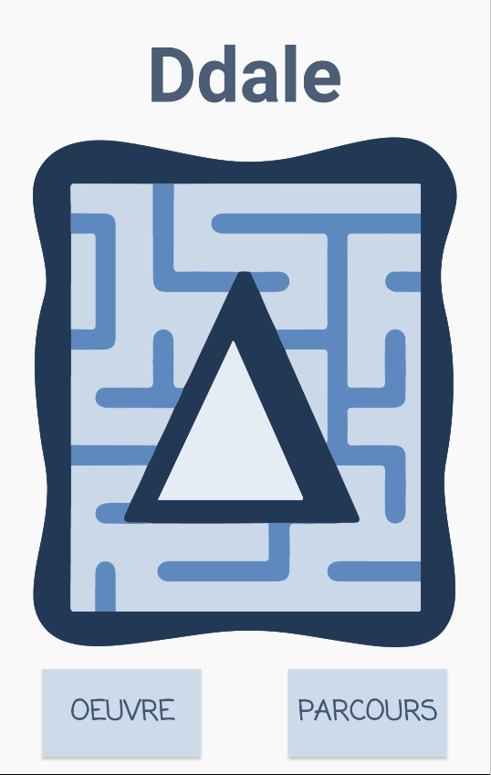
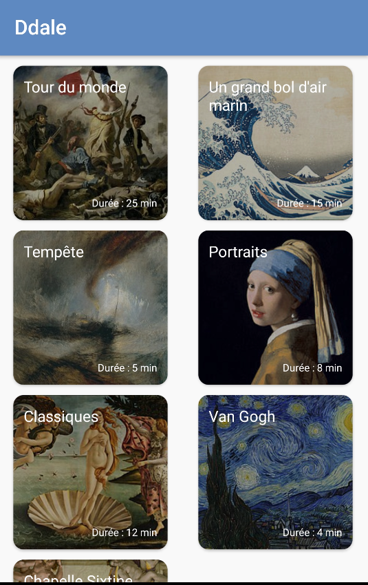
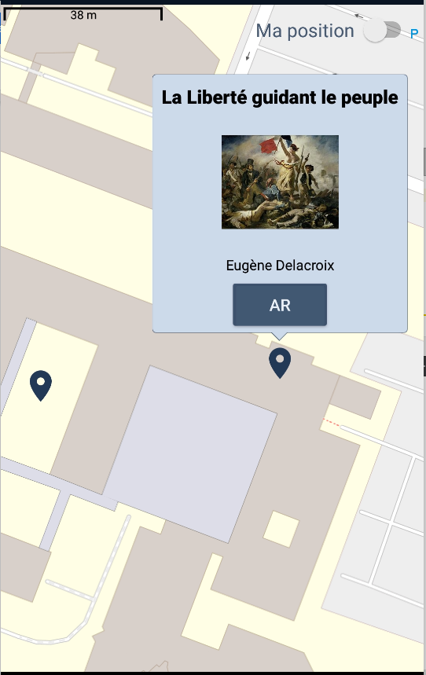
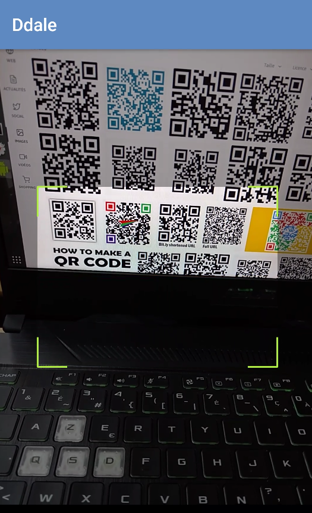
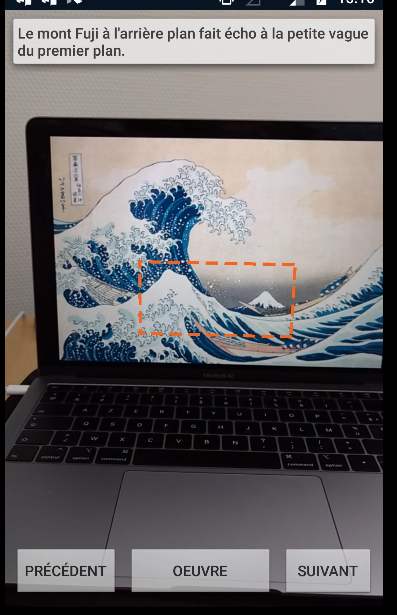

# DdaleApp

Application Android visant à utiliser la réalité augmentée pour agrémenter la visite de musées.

## Screenshots

<figure>

<figcaption>Accueil</figcaption>
</figure>

<figure>

<figcaption>Propositions de différents parcours</figcaption>
</figure>

<figure>

<figcaption>Carte du parcours</figcaption>
</figure>

<figure>

<figcaption>Scan du QR code d'une oeuvre</figcaption>
</figure>

<figure>

<figcaption>Affichage des informations en surimpression et réalité augmentée </figcaption>
</figure>
